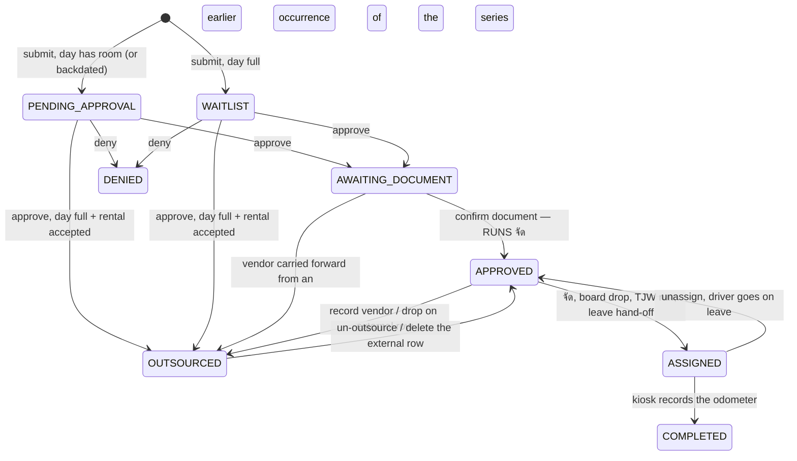

# Booking lifecycle — the status state machine

`Booking.status` is a `BookingStatus` enum (`prisma/schema.prisma:45`) with ten
values. This document says what each one means to the transport office, which
action moves a booking between them, and which status *groups* queries must use.

Dispatch **rules** (who gets the car) are `docs/scheduling-algorithm.md`. This is
only about the status field.

## The ten statuses

| Status | Thai label | What it means in the office | Set by |
|---|---|---|---|
| `DRAFT` | ฉบับร่าง | Nothing. It is the Prisma column default (`schema.prisma:458`) and **no code path ever writes it** — `createBookingAction` always supplies a status. A `DRAFT` row can only come from a raw insert. It still needs a colour, because `STATUS_STYLE` is exhaustive over the enum, and the calendar queries exclude it by name (`app/(admin)/admin/calendar/page.tsx:105`). | — |
| `PENDING_APPROVAL` | รออนุมัติ | Filed, waiting for P'Top to decide. | `createBookingAction` |
| `WAITLIST` | รอคิว | Filed, but the day's guaranteed slots were already full at submit time. Not a refusal — P'Top may still fit it. A **backdated** admin record skips the gate entirely and is always `PENDING_APPROVAL` (`create-booking-action.ts:242-245`). | `createBookingAction` |
| `AWAITING_DOCUMENT` | รอเอกสารอนุมัติ | Approved; the trip *will* happen. Waiting for the signed official form to come back to the transport office. No car yet. | `approveBookingAction` |
| `APPROVED` | อนุมัติแล้ว | Paperwork done, in the dispatch pool. **Overloaded**: it means both "waiting for จัด" and "a driver was matched on the board but the batch has not confirmed". Read `primaryDriverId`, not the status, to know if it has crew. | `approveDocumentAction`, and every un-assign path |
| `ASSIGNED` | จัดรถแล้ว | A car and driver are committed. The only status a trip can be started or completed from at the kiosk (`driver-actions.ts:102`, `:150`). | จัด solver, board drag-drop, TJW run, leave hand-off |
| `COMPLETED` | เสร็จสิ้น | The driver filed the odometer readings at the kiosk. Terminal. | `endTripAction` |
| `OUTSOURCED` | จัดจ้างรถภายนอก | Handed to a hired vehicle/vendor. **Fully off-algorithm** — no car, no driver, in no solver, matcher, capacity or fairness query. | `approveBookingAction` (day full + rental accepted), `recordOutsourcingAction`, `outsourceToRowAction`, `carryVendorToSeriesAction` |
| `DENIED` | ไม่อนุมัติ | Refused, with a reason. Terminal. | `denyByApproverAction`, `denyBookingAction` |
| `CANCELLED` | ยกเลิก | Called off by the requester or an admin. Terminal. | `cancelBookingAction` |

## The machine

Two edges are omitted above because they come from almost anywhere:

- **Cancel** reaches every status except `COMPLETED` and `CANCELLED` — and is
  additionally refused once the trip has departed.
- **Admin deny** (`denyBookingAction`) reaches every status except `DENIED`,
  `CANCELLED` and `COMPLETED` — including `ASSIGNED` and `OUTSOURCED`, and with
  no departed-trip guard (see below).

`matchBookingAction` and `assignBookingAction` are the two dispatch writes that
**do not change status** — see the table below.

## Which action performs which transition

| From → To | Action | Actor |
|---|---|---|
| — → `PENDING_APPROVAL` \| `WAITLIST` | `createBookingAction` `lib/booking/create-booking-action.ts:26`; the choice is `submitStatus(...)` at `:240`, resolved at `:245`, written at `:309` (parent) and `:384` (recurrence children) | requester, or admin on-behalf / backdating |
| `PENDING_APPROVAL` \| `WAITLIST` → `AWAITING_DOCUMENT` | `approveBookingAction` `lib/booking/approval-actions.ts:69`, write at `:191` | ADMIN |
| `PENDING_APPROVAL` \| `WAITLIST` → `OUTSOURCED` | same action; `outsourcing = dayFull && booking.needsOutsourcing` at `:167` | ADMIN |
| `PENDING_APPROVAL` \| `WAITLIST` → `DENIED` | `denyByApproverAction` `approval-actions.ts:329`, write at `:371` | ADMIN |
| `AWAITING_DOCUMENT` → `APPROVED` | `approveDocumentAction` `approval-actions.ts:270`, write at `:294` — **and runs จัด at `:316`** | ADMIN |
| `APPROVED` → `ASSIGNED` | `runBatchForDay` `lib/booking/batch-core.ts:58`, write at `:288` | จัด (manual button, or the nightly cron sweep `app/api/cron/run-batch/route.ts`) |
| `APPROVED` → `ASSIGNED` | `assignTjwByRequestOrder` `lib/booking/tjw-request-actions.ts:31`, write at `:165` | ADMIN (TJW-by-request-order run) |
| `APPROVED` \| `ASSIGNED` → `ASSIGNED` | `reassignVehicleAction` `lib/booking/schedule-actions.ts:38`, write at `:226` | ADMIN (timeline drag-drop) |
| `APPROVED` → `APPROVED` | `matchBookingAction` `lib/booking/matching-actions.ts:29`, write at `:259` — sets driver + `driverScheduleStatus: CLAIMED` (`:265`), **status unchanged** | ADMIN (single-booking matcher) |
| `APPROVED` → `APPROVED` | `assignBookingAction` `lib/booking/actions.ts:29`, write at `:89` — sets `vehicleId` only, no driver | ADMIN (detail page) |
| `ASSIGNED` → `APPROVED` | `unassignBookingAction` `schedule-actions.ts:371`, write at `:418` | ADMIN |
| `APPROVED` \| `ASSIGNED` → `ASSIGNED` or `APPROVED` | driver-leave hand-off `lib/booking/leave-core.ts:262` (เวร driver catches it) / `:268` (nobody can, released to the queue) | ADMIN marking a driver off |
| `ASSIGNED` → `COMPLETED` | `endTripAction` `lib/booking/driver-actions.ts:131`, write at `:188` | assigned driver **or** the shared `driverstation` kiosk (`canRecordTrip`, `driver-actions.ts:77`; `lib/auth/station.ts:15`) |
| `APPROVED` → `OUTSOURCED` | `recordOutsourcingAction` `lib/booking/extra-actions.ts:220`, write at `:274` | ADMIN |
| any → `OUTSOURCED` | `outsourceToRowAction` `lib/booking/adhoc-actions.ts:297` → `attachToRow` `:148`, write at `:162` | ADMIN (drop on an external row) |
| `APPROVED` \| `AWAITING_DOCUMENT` \| `OUTSOURCED` → `OUTSOURCED` | vendor carry-forward: `outsourceToRowAction` `:317-323` and `carryVendorToSeriesAction` `:249`, both via `laterUnplacedSiblings` `:188` — later occurrences of the same series that still have no car | ADMIN |
| `OUTSOURCED` → `APPROVED` | `unoutsourceAction` `adhoc-actions.ts:336` (write `:346`), or `removeAdHocRowAction` `:108` (write `:118`, applies to every trip on the row) | ADMIN |
| any but `COMPLETED`/`CANCELLED` → `CANCELLED` | `cancelBookingAction` `extra-actions.ts:22`, write at `:67` | requester (own booking) or ADMIN |
| any but `DENIED`/`CANCELLED`/`COMPLETED` → `DENIED` | `denyBookingAction` `lib/booking/actions.ts:124`, write at `:148` | ADMIN |

The carry-forward row is the one that surprises people: an occurrence sitting at
`AWAITING_DOCUMENT` can be moved straight to `OUTSOURCED`, skipping `APPROVED`,
because `CARRY_FORWARD_STATUSES` (`adhoc-actions.ts:136`) includes it.

Series variants (`approveSeriesAction`, `denySeriesAction`,
`approveDocumentSeriesAction`, `approval-actions.ts:472/538/587`) loop the
per-booking action over the parent plus its `recurrenceParentId` children. They
change no rules — each occurrence goes through the same gate and can be blocked
independently, which is why they return a per-day `blocked[]` account.
`approveDocumentSeriesAction` re-reads the series afterwards (`:619-633`) and
reports any occurrence that came out `APPROVED` with no driver as blocked too,
since จัด running is not the same as จัด succeeding.

`startTripAction` (`driver-actions.ts:85`) does **not** change status: it creates
the `Trip` row with `startedAt` (`:113`). That timestamp is what the
departed-trip guards below read.

Two dev-only actions write `APPROVED` / `ASSIGNED` directly when creating sample
rows — `batch-demo-actions.ts:201` and `simulate-actions.ts:287`, both behind
`isSimulationEnabled()`. They are not transitions and not part of this machine.

### Confirming the document runs the scheduler

This is the transition that surprises people. Approving used to hand out a car;
it no longer does. **`approveDocumentAction` calls `runBatchForDay` for the
booking's own day** (`approval-actions.ts:316`), so pressing "เอกสารเรียบร้อย" on
one booking can assign drivers to *every* unassigned `APPROVED` booking that day.

Three consequences worth knowing:

- The solver call is wrapped in its own `try` (`:315-319`). If จัด throws, the
  booking stays `APPROVED` and simply shows as driverless on that day's board —
  a consequence must not be able to undo its cause.
- `runBatchForDay` returns immediately for any day already past
  (`batch-core.ts:81`). Backdated bookings carry their real crew from the form,
  so there is nothing to solve; without this guard, confirming paperwork on a
  nine-day-old trip assigned a driver by rotation and moved their fairness clock
  backwards.
- The write to `APPROVED` is what creates the `VehicleOccupancy` rows, so it can
  be refused by the exclusion constraint. That is caught at `:304-307` and
  returned as a friendly `vehicleConflict` instead of a 500.

## What the requester sees

`requesterFacingStatus` (`lib/booking/status-style.ts:139`) collapses three
statuses to `PENDING_APPROVAL` before display:

| Stored | Requester sees |
|---|---|
| `DRAFT`, `WAITLIST`, `AWAITING_DOCUMENT` | `PENDING_APPROVAL` — รออนุมัติ |
| everything else | itself |

The reason is that "รอเอกสารอนุมัติ" is the office's own bookkeeping about a form
the requester never handles — it is printed, signed and filed by the transport
office; there is no upload on the requester's side. Printing it invites the
question "what document?". `OUTSOURCED` deliberately does *not* collapse: the
requester asked for an outside rental, so it is their answer, not bookkeeping.

The collapse is **opt-in at the badge**: `BookingStatusBadge` takes
`audience="staff" | "requester"` and defaults to staff
(`components/booking-status-badge.tsx:15`, applied at `:21`). Only three call
sites pass `requester`: `app/(requester)/requester/upcoming/page.tsx:280`,
`app/(requester)/requester/[id]/page.tsx:91`, and
`components/requester-booking-list.tsx:81`. Staff surfaces keep the raw status —
the admin queue has a whole section keyed on `AWAITING_DOCUMENT`
(`app/(admin)/admin/page.tsx:133`), and that section is where จัด gets triggered.

`STATUS_STYLE` in the same file (`status-style.ts:29`) is
`Record<BookingStatus, …>` on purpose: adding a status to the enum fails the
build until it is given a colour. A previous `Record<string, …>` copy in the
month calendar silently drew a third of every month's bookings with no status
colour. `status-style.test.ts:41` additionally asserts the badge still branches
on audience, and `:34` that every requester-facing status has a
`messages/th.json` key — next-intl resolves keys at runtime, so a missing one
renders the raw key path to a Thai user.

## Status groups used in queries

Three exported lists. Picking the wrong one is the recurring bug in this area.

| Group | Defined | Members | Answers |
|---|---|---|---|
| `COMMITTED_STATUSES` | `lib/booking/booking-status.ts:17` | `APPROVED`, `ASSIGNED`, `COMPLETED` | "does this count against a driver's or car's availability, and toward fairness?" |
| `DISPATCHABLE_STATUSES` | `lib/booking/booking-status.ts:36` | `APPROVED`, `ASSIGNED` | "may a dispatch action still write a car and driver onto this?" |
| `SLOT_HOLDING_STATUSES` | `lib/booking/slot-capacity.ts:23` | `PENDING_APPROVAL`, `AWAITING_DOCUMENT`, `APPROVED`, `ASSIGNED`, `COMPLETED` | "does this occupy one of the day's guaranteed submit-time slots?" |

**`COMMITTED_STATUSES` includes `APPROVED` on purpose.** The board's single
matcher leaves a claimed trip at `APPROVED` with `driverScheduleStatus: CLAIMED`
and the driver set (`matching-actions.ts:259-265`); only the batch confirms it to
`ASSIGNED`. Queries filtering on `ASSIGNED|COMPLETED` alone missed those, so a
driver still away on a claimed multi-day TJW looked both free and idle. Always
pair this list with a `primaryDriverId`/`secondaryDriverId` filter, or an
`APPROVED`-but-unassigned booking is counted as a commitment.

**Do not substitute `COMMITTED_STATUSES` for `DISPATCHABLE_STATUSES`.** It
contains `COMPLETED`, which already happened and must never be re-dispatched
(§9b). `reassignVehicleAction` originally read *no* status at all, and at the
time cancel and deny both **left `overflowReason` set** while `/admin/batch`
listed overflow by `overflowReason: { not: null }` — so a `CANCELLED` or `DENIED`
trip appeared as outstanding work with a one-click assign, and one click
committed a real car and wrote a `VehicleOccupancy` row that then blocked a real
booking. All three sides are now closed: cancel and deny null the reason
(`extra-actions.ts:67`, `actions.ts:148`), the query filters on status
(`app/(admin)/admin/batch/page.tsx:173`), and the write is gated
(`schedule-actions.ts:66`).

**`AWAITING_DOCUMENT` missing from `SLOT_HOLDING_STATUSES` was a real bug**, and
it is the canonical example of why these lists must be re-derived when a status
is added. `AWAITING_DOCUMENT` was inserted into the pipeline after the constant
was written and never added to it. A day whose approvals were all parked on
paperwork therefore read as empty: new requests came in as `PENDING_APPROVAL`
instead of `WAITLIST` (`create-booking-action.ts:238`), overselling the day, and
the "x/y slots used" readout under-reported what was committed
(`detail-context.ts:100`). The fix in `slot-capacity.test.ts:81` is worth
copying: the test states the *rule* over the live enum — everything not on an
explicit `HOLDS_NO_SLOT` list (`:88`) holds a slot — so a newly added status
fails the test until someone decides which side it belongs on. The previous test
pinned the four literals and kept passing while the value was wrong.

Smaller lists exist for narrower questions and are not interchangeable with the
three above: `BATCH_SOLVABLE_WHERE` (`batch-core.ts:36`, shared by the solver and
the cron sweep so they cannot ask different questions — note it also excludes
`isEmergency` and `TJW`, which need a human), `CARRY_FORWARD_STATUSES`
(`adhoc-actions.ts:136`), `ACTIVE_BOOKING_STATUSES` /
`HISTORY_BOOKING_STATUSES` (`components/requester-booking-list.tsx:9,23`), and
`CALENDAR_STATUS_LEGEND` (`status-style.ts:157`).

### The database has its own copy

The `sync_vehicle_occupancy()` trigger writes occupancy rows only when
`NEW.status IN ('APPROVED','ASSIGNED','COMPLETED')`
(`prisma/migrations/20260819100000_in_chula_may_share_a_car/migration.sql:48`) —
the same three as `COMMITTED_STATUSES`, hardcoded in SQL. **A new status that
should hold a car needs a migration, not just an edit to `booking-status.ts`.**
The trigger (`booking_occupancy_sync`, created in
`20260701120000_vehicle_occupancy_no_double_book/migration.sql:64-66`) fires on
every `Booking` insert, update and delete, and *deletes* the booking's occupancy
rows before re-inserting — so any write that moves a status out of those three
frees the car immediately.

Two exclusion constraints enforce it (`20260819100000…/migration.sql:73` and
`:78`), which is why several actions catch `isExclusionViolation` and degrade to
`vehicleConflict` rather than 500. Note the §5c in-Chula exception's *window* is
not expressible in the constraint; that bound lives in
`lib/booking/vehicle-conflicts.ts` and every write path must call it.

Also note that `COMPLETED` still holds the car for its **original** `startAt`–
`endAt` window: occupancy is derived from those columns, never from `completedAt`,
so finishing early does not free the slot (`lib/booking/actions.ts:50-55`).

## The guards

### Refuse a departed trip (`trip.startedAt`)

§9b: once the car has left, it is not re-dispatchable — the driver is physically
on the road.

| Action | Line |
|---|---|
| `reassignVehicleAction` | `schedule-actions.ts:57` |
| `unassignBookingAction` | `schedule-actions.ts:389` |
| `setBookingTimeAction` | `schedule-actions.ts:485` |
| `cancelBookingAction` | `extra-actions.ts:44` |
| driver-leave sweep | `leave-core.ts:415` — does not refuse; flags `overflowReason: DRIVER_OFF_NEEDS_REVIEW` and keeps the driver. Also catches a multi-day trip that began on an earlier day (`b.startAt < day`). |
| `runBatchForDay` | `batch-core.ts:81` — refuses whole past days |

**`denyBookingAction` has no such guard** (`actions.ts:124-140`). An ADMIN can
deny a trip that has already departed; the write to `DENIED` takes it out of the
trigger's status set, so its occupancy rows are deleted and the car reads as free
while it is on the road. `cancelBookingAction` was given the guard for exactly
this reason — the requester-reachable path had the same hole
(`extra-actions.ts:39-46`) — and deny never was.

`/admin/batch`'s overflow list additionally filters `primaryDriverId: null`
(`app/(admin)/admin/batch/page.tsx:167`) so a frozen `DRIVER_OFF_NEEDS_REVIEW`
trip cannot be un-frozen by one click.

### Refuse based on status

| Action | Accepts | Line |
|---|---|---|
| `approveBookingAction` | `PENDING_APPROVAL`, `WAITLIST` | `approval-actions.ts:86` |
| `denyByApproverAction` | `PENDING_APPROVAL`, `WAITLIST` | `approval-actions.ts:349` |
| `approveDocumentAction` | `AWAITING_DOCUMENT` only | `approval-actions.ts:281` |
| `assignBookingAction` | `APPROVED` only | `actions.ts:44` |
| `matchBookingAction` | `APPROVED` only, and rejects one that already has a primary | `matching-actions.ts:51`, `:54` |
| `recordOutsourcingAction` | `APPROVED` only | `extra-actions.ts:242` |
| `reassignVehicleAction` | `DISPATCHABLE_STATUSES` | `schedule-actions.ts:66` |
| `reassignSecondaryAction` | `DISPATCHABLE_STATUSES` | `schedule-actions.ts:297` |
| `unassignBookingAction` | `DISPATCHABLE_STATUSES` | `schedule-actions.ts:396` |
| `setBookingTimeAction` | `COMMITTED_STATUSES` | `schedule-actions.ts:486` |
| `startTripAction` | `ASSIGNED` only | `driver-actions.ts:102` |
| `endTripAction` | `ASSIGNED` only | `driver-actions.ts:150` |
| `cancelBookingAction` | anything but `COMPLETED`, `CANCELLED` | `extra-actions.ts:53` |
| `denyBookingAction` | anything but `DENIED`, `CANCELLED`, `COMPLETED` | `actions.ts:138` |

Three actions read **no status at all**: `outsourceToRowAction`
(`adhoc-actions.ts:297`), `unoutsourceAction` (`:336`), and
`removeAdHocRowAction` (`:108` — it rewrites *every* booking attached to the row
to `APPROVED`, whatever its status). They are ADMIN-only and reached from the
timeline board, but nothing in the action layer stops them moving a dead or
completed booking. `carryVendorToSeriesAction` (`:249`) also reads no status on
the booking it is invoked from, but the siblings it rewrites are filtered by
`CARRY_FORWARD_STATUSES` and must still have no car (`:188-202`).

Note that `setBookingTimeAction`'s status gate admits `COMPLETED`
(`COMMITTED_STATUSES` includes it), but the `trip.startedAt` check one line
earlier catches it in practice: completing always writes a `Trip` with a
`startedAt` (`driver-actions.ts:165-168` upserts one if the driver never tapped
"start").

### Guards that are not about status

- **Capacity at approval.** `dayHasRoomFor` (`lib/booking/approval-capacity.ts:72`)
  asks the placement engine the same question จัด will ask. On a full day,
  approval is refused with `dayFull: true` (`approval-actions.ts:139-148`) so the
  queue can offer the board instead. `force=1` overrides it, but the override
  requires a ≥3-character comment enforced server-side
  (`approval-actions.ts:157-158`), because `approveSchema.comment` is optional and
  a direct caller could otherwise record an unexplained override. `force` **must**
  stay declared in `approveSchema` (`:53`) — `z.object` strips undeclared FormData
  keys silently.
- **One-way trips.** A booking with `returnTrip: false` carries a provisional
  `endAt`; the admin must supply the real one at approval
  (`approval-actions.ts:96-103`), and it must not land before a no-wait trip's leg
  split points (`:111-121`), or leg 2 inverts and every overlap check reads the
  car as free.
- **Never placed on an internal car.** `jobType === "SMUS"` and
  `preferredVehicleType === "BUS_OUTSOURCED"` are refused by
  `reassignVehicleAction` (`schedule-actions.ts:70`, `:72`) and
  `matchBookingAction` (`matching-actions.ts:44`, `:48`), and excluded from
  `BATCH_SOLVABLE_WHERE` (`batch-core.ts:43-44`).

## Every transition is audited

All status writes go through `logTransition` (`lib/booking/audit.ts:10`), which
records `fromStatus`, `toStatus`, `actorUserId`, a free-form `action` code and
optional `metadata`. Pass `tx` to enrol the audit row in the same transaction as
the status write — every status-changing call site above does. (Non-booking
decisions — marking a driver off, swapping a เวร day, re-pairing a car — use
`logEvent` in the same file, `:45`.)

Two things to keep in step when adding a transition:

- The booking history page renders `action`, **never** `metadata`
  (`app/(admin)/admin/[id]/page.tsx:552-565`). A distinction recorded only in
  metadata is stored and still invisible — which is why forced and outsourced
  approvals get their own action codes rather than a boolean
  (`approval-actions.ts:207-211`).
- `action` is an untyped string. Add the Thai label to `AUDIT_ACTION_TH`
  (`lib/booking/audit-labels.ts:16`) or the page falls back to the humanised
  code, printing English at a Thai-only user.
