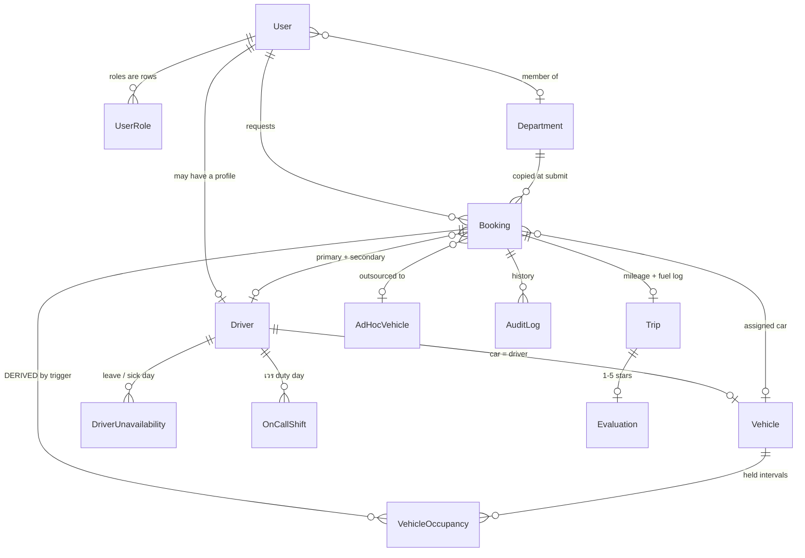

# The data model

`prisma/schema.prisma` (785 lines) is the whole schema; `prisma/migrations/`
holds 54 migration directories. **Prisma does not own everything in this
database.** One extension, two functions, one trigger and two exclusion
constraints exist only as raw SQL inside migrations, and they enforce the rule
this system exists to protect. Read [§ What the database enforces
itself](#what-the-database-enforces-itself) before you touch anything near
`Booking`, `Vehicle`, or `VehicleOccupancy`.

Dispatch *rules* are not here — they live in
[`docs/scheduling-algorithm.md`](scheduling-algorithm.md). This file is about
the storage those rules run on.

## Core entities



| Entity | What it is | The thing people get wrong |
|--------|------------|----------------------------|
| `User` (`:182`) | Every human. Sign-in is username **or** email + bcrypt hash; sessions are JWT (`auth.ts:41`) and **no Prisma adapter is configured**, so `Account`/`Session`/`VerificationToken` are never written at all. | Roles are rows in `UserRole`, not a column. The only `user.delete` in the codebase is the no-history driver-removal branch (`lib/admin/driver-actions.ts:212`); anyone with history is retired by `isActive = false` (`:196-209`). |
| `UserRole` (`:248`) | `@@unique([userId, role])` — a *set* of roles. | The schema can hold several; the admin form deliberately posts exactly one (`components/forms/create-user-form.tsx:20-27`). Don't assume a single row in queries, and don't build screens for multi-role. |
| `Department` (`:257`) | ภาควิชา. Optional `head` and `representative`, both `@unique` → one user each. | `Booking.departmentId` is resolved from the **requester's own profile** at submit and frozen there (`lib/booking/create-booking-action.ts:194-201`, written at `:252`). Moving a user to another department does not move their old bookings. |
| `Driver` (`:320`) | The driving profile hanging off a `User` (`userId @unique`). Holds the roster fields and four rotation clocks (`lastAssignedAt`, `lastTjwAt`, `lastOtAt`, `lastDutyAt`). | Drivers are passive — no individual login in practice; they share the `driverstation` kiosk account, allow-listed by email via `DRIVER_STATION_EMAILS` (`lib/auth/station.ts:8-17`). P'Top assigns everything. |
| `Vehicle` (`:273`) | A car. `assignedDriverId` is `@unique` → **car = driver**, one driver owns at most one car. | `isDutyVehicle` is marked deprecated at `:280` and *is* dead to dispatch — but the submit-time slot gate still counts it (`create-booking-action.ts:231-232`, `detail-context.ts:109-113`). Today's duty driver comes from `OnCallShift`, not this flag (`classification.ts:7-9`). |
| `Booking` (`:379`) | The request and everything decided about it — one wide table, on purpose. | `endAt` is `NOT NULL` even for one-way trips (`returnTrip = false`), where it holds a *provisional* value until an admin sets the real one at approval (`approval-actions.ts:93-103`). |
| `VehicleOccupancy` (`:302`) | Per-leg occupied intervals for a car. One row for a waiting trip, two for a no-wait trip. | **Derived. Never written by application code** — the only `prisma.vehicleOccupancy` references in the repo are in tests. See below. |
| `Trip` (`:711`) | The post-drive log: mileage, fuel, tolls, parking. `bookingId @unique`. | Created when the driver starts the trip at the kiosk (`lib/booking/driver-actions.ts:112`), or auto-created with `startMileage: 0` when a requester rates a legacy completed booking (`extra-actions.ts:155-168`). Its absence does not mean the trip did not run. |
| `OnCallShift` (`:617`) | The เวร roster. `date @unique @db.Date` — exactly **one** driver on duty per calendar day, system-wide. | `@db.Date` (see [Traps](#traps)). The FK to `Driver` is `ON DELETE RESTRICT`, which is why a driver who has ever been on duty can only be deactivated. |
| `DriverUnavailability` (`:365`) | Leave / sick day. `@@unique([driverId, date])`, `@db.Date`. | Removing a driver's row is not the same as un-doing §9b hand-offs. Also `@db.Date`. |
| `AdHocVehicle` (`:667`) | A per-day board row for an outside vendor's vehicle. Not a `Vehicle`; invisible to every algorithm. | `Booking.adHocVehicleId` is `onDelete: SetNull` (`:540-541`) — deleting the row leaves the booking `OUTSOURCED` with the contact details already copied onto it (`:513-518`). |
| `AuditLog` (`:761`) | Who did what. `bookingId` is nullable since 2026-08-10. | Non-booking events set `entityType`/`entityId` instead: `"DRIVER" \| "ON_CALL" \| "VEHICLE" \| "USER"` (`lib/booking/audit.ts:33` — the schema comment at `:771` still lists only three, but all four are in use). A query filtering on `bookingId` alone misses them. |

Live but low-traffic: `BookingClaim` (still written by the matcher as a
denormalised record, `matching-actions.ts:272`), `RecurrenceRule`
(`create-booking-action.ts:340`), `TripTemplate` (`template-actions.ts`), and
`PasswordResetToken` — which **is** fully wired, contrary to the schema comment
at `:236-237`: `/forgot` and `/reset/[token]` drive it through
`lib/auth/credentials-actions.ts:226-282`.

Two tables are **dead** — zero references in any `.ts`/`.tsx` file, only the
schema mentions them: **`BookingDraft` (`:652`)**, left over from the removed
driver draft board, and **`SavedPlace` (`:556`)**, whose destination-picker was
replaced by `TripTemplate`.

## What the database enforces itself

The rule: *no car may hold two overlapping trips* (scheduling doc §5). It is not
enforced by application discipline alone. The chain is:

```
Booking  --(AFTER INSERT/UPDATE/DELETE trigger)-->  VehicleOccupancy
                                                     |
                                            two GiST EXCLUDE constraints
```

| Object | Where |
|--------|-------|
| `CREATE EXTENSION btree_gist` | `20260701120000_vehicle_occupancy_no_double_book/migration.sql:31` |
| `booking_leg2_start(timestamp, text)` | same file, `:35` |
| `sync_vehicle_occupancy()` | same file `:41`, **replaced** at `20260819100000_in_chula_may_share_a_car/migration.sql:42` |
| `TRIGGER booking_occupancy_sync` | same file, `:64` |
| `vehicle_occupancy_no_overlap` | redefined at `20260819100000_…:73-76` |
| `vehicle_occupancy_chula_vs_normal` | `20260819100000_…:78-80` |

`btree_gist` is what makes the constraints possible at all: a GiST exclusion
index has to compare `"vehicleId"` with `=` and `"inChula"` with `<>` alongside
`tsrange(...) WITH &&`, and stock GiST has no operator classes for `text` or
`boolean`. Without the extension the migration fails outright, which is the
`permission denied to create extension "btree_gist"` error the README
troubleshoots (`README.md:459`; the account needs to own the database).

### Occupancy is derived — you never write it

`sync_vehicle_occupancy()` deletes every row for the booking and re-inserts from
scratch on **every** insert, update and delete of a `Booking`. Consequences a
newcomer trips over:

- **The `id` is `gen_random_uuid()::text`, not a cuid.** Prisma's
  `@default(cuid())` on `VehicleOccupancy.id` never runs, because Prisma never
  inserts.
- **Any `Booking` update re-validates the constraints.** The trigger has no
  `WHEN` clause and no column list, so editing `remark` re-derives and re-checks
  the intervals.
- **A row exists only when `vehicleId IS NOT NULL` and
  `status IN ('APPROVED','ASSIGNED','COMPLETED')`.** That is the same list as
  `COMMITTED_STATUSES` (`lib/booking/booking-status.ts:17`). `COMPLETED` is in
  it deliberately — a finished trip still holds its car for the window it ran.
  Cancelling or denying a booking frees the car by deleting the rows.
- **A no-wait trip writes two rows** when `waitAtDestination = false` **and**
  `dropOffDone IS NOT NULL` **and** `pickupReturnTime IS NOT NULL`. Leg 2 starts
  at `booking_leg2_start(startAt, pickupReturnTime)`, which resolves the `HH:mm`
  string on the **Bangkok** calendar day of `startAt`. This mirrors
  `lib/booking/trip-legs.ts`; both assume the app timezone is `Asia/Bangkok`.
  If those two ever disagree, the DB and the app disagree about when a car is
  free — which is exactly what `lib/booking/vehicle-occupancy.test.ts:75-85`
  pins down, by asserting the stored rows equal `tripLegs()` interval for
  interval.

### When it rejects a write

Postgres raises `SQLSTATE 23P01`. Callers must recognise it or the admin gets a
500 — `isExclusionViolation()` (`lib/booking/db-errors.ts:9`) matches the code,
the text `exclusion_violation`, and the constraint name. Note it names only
`vehicle_occupancy_no_overlap`, not the newer `vehicle_occupancy_chula_vs_normal`
(the code and generic-text branches still catch it).

Because the trigger fires per row, **never wrap a multi-booking dispatch in one
transaction.** One conflicting write rolls the whole batch back and records no
overflow reason to explain it — the exact regression documented at
`lib/booking/batch-core.ts:231-253` and `lib/booking/tjw-request-actions.ts:143-152`.
Both loops are now one transaction *per assignment*.

The database is the backstop, not the first line. The paths that commit a car
check first, so the user gets a named conflict instead of an opaque error:

| Path | Check |
|------|-------|
| `matching-actions.ts:244`, `batch-core.ts:266` | shared helper `findVehicleConflicts()` (`lib/booking/vehicle-conflicts.ts:61`) |
| `schedule-actions.ts:99-131` (drag/reassign) and `:518-547` (time edit) | equivalent inline scans |
| `actions.ts:56-74` (admin detail page) | inline buffer scan |
| `leave-core.ts:86-119` (§9b hand-off) | driver-keyed, via `dutyCanAbsorb` → `canTakeTrip` → `canChain` |
| `tjw-request-actions.ts:194` | **no pre-scan** — it relies on catching 23P01 and recording the booking as overflow |

## §5c: why two constraints, and the bound the DB cannot hold

The office asked for one exception: two campus errands starting within ten
minutes may share a car. The obvious implementation — making the single
constraint partial with `WHERE (NOT "inChula")` — is wrong, and wrong quietly: a
partial index simply does not contain in-Chula rows, so a campus errand could be
stacked onto a car that is 400 km away on a ตจว trip.

What is wanted is *conflict unless **both** rows are in-Chula*, which no single
`EXCLUDE` can express. Hence two:

| Constraint | Shape | Catches |
|------------|-------|---------|
| `vehicle_occupancy_no_overlap` | `WHERE (NOT "inChula")` | normal vs normal |
| `vehicle_occupancy_chula_vs_normal` | adds `"inChula" WITH <>` | in-Chula vs normal |
| *(neither)* | — | in-Chula vs in-Chula → **permitted** |

`VehicleOccupancy.inChula` (`:314`) is a copy of `Booking.travelWithinChula`
written by the trigger. It has to live on the occupancy row because an exclusion
constraint can only see columns of its own table. Flip `travelWithinChula` on an
existing booking and the trigger rewrites the rows — a pair that was legally
sharing a car will start conflicting.

**The ten-minute window is NOT in the database.** Two in-Chula rows satisfy
neither constraint at *any* start distance, so Postgres would accept two campus
errands six hours apart on one car. The bound lives entirely in
`sharesCarWith()` (`lib/booking/rotations.ts:135`, window at `:34` =
`IN_CHULA_PAIR_WINDOW_MINUTES = 10`, measured start-to-start). Any new write
path that assigns a car must call it — via `findVehicleConflicts`, `canChain`,
or its own scan — or the exception silently widens to "in-Chula trips never
conflict".

There is also **no ceiling**: five in-Chula bookings at 09:00 all stack on one
car and only the app warns. That was the office's explicit, recorded choice
(`20260819100000_…:25-28`).

## The enums

`BookingStatus` (`:45`) — the office pipeline. Postgres orders enums by
declaration, and `AWAITING_DOCUMENT` was added with `ADD VALUE … BEFORE
'APPROVED'` so the enum's own order still reads as the real sequence.

| Value | What it means in the office | Requester sees |
|-------|-----------------------------|----------------|
| `DRAFT` | Schema default only — **no code path ever writes it.** The calendar queries explicitly exclude it (`admin/calendar/page.tsx:105`). | folded to รออนุมัติ |
| `PENDING_APPROVAL` | Filed, waiting on the department head. | รออนุมัติ |
| `WAITLIST` | Submitted when the day's guaranteed slots were already full (`slot-capacity.ts:60`). Not a rejection — P'Top may still approve it (`approval-actions.ts:86`). | folded to รออนุมัติ |
| `AWAITING_DOCUMENT` | Approved; the printed form is out for signature. **จัด does not run on approval — it runs when an admin confirms this document** (`approval-actions.ts:191`, then `runBatchForDay` at `:316`). | folded to รออนุมัติ |
| `APPROVED` | Decided, needs a car. Everything downstream that means "now dispatch it" keys on this. | อนุมัติ |
| `ASSIGNED` | Car + driver committed. | มีรถแล้ว |
| `OUTSOURCED` | Handed to an external vendor, on a board row or via the manual vendor form. Also set straight from approval when the fleet is full and the requester accepted a rental (`approval-actions.ts:191`). Off-algorithm entirely — no matcher, solver, capacity or fairness query sees it. | its own badge |
| `COMPLETED` | Driven and closed. Still holds its car in `VehicleOccupancy`. | outcome |
| `DENIED` / `CANCELLED` | Terminal. Frees the car. | outcome |

The requester deliberately sees **less**: `requesterFacingStatus()`
(`lib/booking/status-style.ts:139`) collapses `DRAFT`, `WAITLIST` and
`AWAITING_DOCUMENT` into `PENDING_APPROVAL` — from their side all three are
"still waiting", and the requester never handles the document at all. Staff
surfaces keep the raw value.

Three status *sets* matter more than the individual values, and picking the
wrong one is a recurring bug class:

| Set | Members | Question it answers |
|-----|---------|---------------------|
| `COMMITTED_STATUSES` (`booking-status.ts:17`) | APPROVED, ASSIGNED, COMPLETED | Does this count against availability / fairness? Matches the occupancy trigger exactly. |
| `DISPATCHABLE_STATUSES` (`:36`) | APPROVED, ASSIGNED | May a dispatch action write a car onto this? Excludes COMPLETED. |
| `SLOT_HOLDING_STATUSES` (`slot-capacity.ts:23`) | those three + PENDING_APPROVAL, AWAITING_DOCUMENT | Does this occupy one of the day's guaranteed slots? |

Other enums:

| Enum | Values and meaning |
|------|--------------------|
| `Role` (`:15`) | `REQUESTER` (files requests) / `ADMIN` (P'Top — decides everything) / `DRIVER` (kiosk). |
| `JobType` (`:100`) | Scheduling priority, TJW → OT → WERN → NORMAL. `TJW` ต่างจังหวัด = out-of-province **and** overnight; `OT` = overnight same-area, or start < 08:00, or end > 16:00; `WERN` รถเวร = the duty driver's campus rounds, forced whenever `travelWithinChula` (`create-booking-action.ts:299-307`); `NORMAL` ทั่วไป = short on-campus run inside 08:00–16:00; `SMUS` = external charter, never emitted by the classifier (`lib/booking/classification.ts:54-71`). |
| `VehicleType` (`:21`) | The owned fleet's physical class. |
| `PreferredVehicleType` (`:32`) | What the requester *asked for*. **A preference, never a filter** (scheduling doc §5b): it can break a tie between free cars (`matching.ts:95`) but never blocks one. The exception is `BUS_OUTSOURCED`, which really does gate — excluded from the batch (`batch-core.ts:44`) and forces `needsOutsourcing` at submit (`create-booking-action.ts:277`). `SEDAN_DEAN` is one named car. |
| `TripType` (`:110`) | Off the paper form: ไป-กลับ / ไปส่ง / ไปรับ-ส่ง. Nullable, display-only. |
| `TimeBucket` (`:136`) | Derived from `startAt` at create and persisted so the slot grid is cheap to read (`create-booking-action.ts:308`). |
| `OverflowReason` (`:121`) | Why a booking missed the batch. `NEEDS_WERN_RECLAIM_DECISION` = P'Top must choose duty-vs-outsource; `DRIVER_OFF_NEEDS_REVIEW` = §9b flagged a trip already departed or spanning in from an earlier day, which is never silently re-dispatched. |
| `DriverPool` (`:40`), `DriverScheduleStatus` (`:76`), `ClaimRole`/`ClaimStatus` (`:82`,`:87`), `ApprovalStatus` (`:67`) | Live but low-traffic. `driverScheduleStatus` survives the removal of driver self-claiming: the matcher sets `CLAIMED` (`matching-actions.ts:265`), the solver sets `CONFIRMED` (`batch-core.ts:289`). |

`jobType` is **privilege-gated, not just validated**. It is declared in the zod
schema (`lib/booking/schema.ts:107`), so a requester could post it — the action
drops any requester-supplied value unless it is `SMUS`, while an admin may set
any value: `isAdmin || data.jobType === "SMUS" ? data.jobType : undefined`
(`lib/booking/create-booking-action.ts:84`). Posting `jobType=TJW` used to put an
ordinary errand at the head of the queue. Keep that gate if you touch the field.

## Traps

### `@db.Date` reads back as UTC midnight

Three columns are `@db.Date`: `DriverUnavailability.date` (`:371`),
`OnCallShift.date` (`:619`) and `AdHocVehicle.date` (`:669`).

Every writer here hands in a **local** midnight. Prisma truncates a `@db.Date`
to the **UTC** date part, so under `Asia/Bangkok` (+07) the stored calendar date
is the day *before* the one intended, and the value read back is UTC midnight of
that earlier date. Measured: writing local midnight of 2027-09-14 stores
2027-09-13 and reads back `2027-09-13T00:00:00Z`.

*Querying* is safe — the query value is truncated identically, so
`where: { date: localMidnight }` matches. What is **not** safe is deriving a key
from the returned value: `startOfDay(row.date)` and `format(row.date,
"yyyy-MM-dd")` both give the stored date, a day off. That mismatch silently made
three leave/duty checks look at the wrong day — a driver on leave could be
rostered as เวร, handed a multi-day ตจว, or recommended for OT.

Use `dbDateKey()` for comparison and `localDayOfDbDate()` for display or
iteration, both in `lib/booking/db-date.ts:41,61` (`driverDayKey()` at `:46` for
the per-driver leave lookups). The stored values were never migrated; the
helpers key correctly either way.

### Nullable columns the code treats as present

| Column | Reality |
|--------|---------|
| `Booking.estimatedDistance` (`:469`) | **Usually `null` in production** — it is only ever filled by the admin's "estimate from Google Maps" button, itself gated on `GOOGLE_MAPS_API_KEY` (`lib/maps/distance.ts:9`). Every pairing site ORs it with `needsSecondaryDriver`, which makes that manual flag the only trigger that actually fires (`lib/booking/placement-reco-data.ts:21-30`). |
| `Booking.endAt` (`:391`) | `NOT NULL`, but provisional when `returnTrip = false` until an admin sets it at approval. Occupancy is derived from it either way. |
| `Booking.dropOffDone` / `pickupReturnTime` (`:442`,`:436`) | Only meaningful together with `waitAtDestination = false`. The trigger splits into two legs only when **all three** conditions hold; get one wrong and the car is held for the whole day instead of two legs. |
| `Vehicle.assignedDriverId` (`:286`) | Nullable — an unpaired car is a valid state — but reco code asserts a car exists for a driver (`overtime-reco.ts:71`, `placement-reco.ts:98,165`) because those candidate lists are pre-filtered on `d.vehicleId` and the solver only picks car-paired drivers. |
| `Booking.tripType` (`:411`) | Nullable and display-only; nothing branches on it. |

`Booking.outsideChula` no longer exists — added by a merge reconciliation and
dropped in `20260717103600_drop_booking_outside_chula`. `travelWithinChula` is
the sole in-Chula signal, and `createBookingAction` forces it false whenever
`outOfProvince` is set (`:90`) so a requester cannot switch off the no-double-book
backstop for a province run.

### Cascades

Enforced by real Postgres foreign keys, so raw SQL fires them too.

| Delete | Cascades to | Does **not** touch |
|--------|-------------|--------------------|
| `User` | `UserRole`, `Account`, `Session`, `Driver`, `SavedPlace`, `TripTemplate`, `PasswordResetToken` | `Department.headUserId`/`representativeUserId` → `SET NULL`; blocked by `RESTRICT` from `Booking.requesterId`, `Approval.approverId`, `AuditLog.actorUserId`, `Cancellation.cancelledByUserId` |
| `Booking` | `Approval`, `Trip` (→ `Evaluation`), `Cancellation`, `AuditLog`, `BookingClaim`, `BookingDraft`, `RecurrenceRule`, `VehicleOccupancy` | `Booking.recurrenceParentId` → `SET NULL` |
| `Driver` | `DriverUnavailability` | `Booking.primaryDriverId`/`secondaryDriverId` → `SET NULL`; `Vehicle.assignedDriverId` → `SET NULL`; **`OnCallShift` and `BookingClaim` are `RESTRICT`** |
| `Vehicle` | — | `Booking.vehicleId` → `SET NULL`; **`VehicleOccupancy.vehicleId` is `RESTRICT`** |
| `AdHocVehicle` | — | `Booking.adHocVehicleId` → `SET NULL` |
| `Department` | — | `User.departmentId` → `SET NULL`; blocked by `RESTRICT` from `Booking.departmentId` |

The two `RESTRICT`s are why removal is a two-branch operation, not a delete:

- **Drivers** (`lib/admin/driver-actions.ts:159-220`): refuses while upcoming
  dispatchable trips exist (`:185-194`); then hard-deletes the `User` (cascading
  to `Driver`) only when there is no history at all, otherwise deactivates both.
  `onCallShifts` and `claims` are counted as history precisely *because* their
  FKs are `RESTRICT` (`:170-174`, `:196-201`) — a driver ever on a เวร day is
  deactivated, never hard-deleted, so the 500 that would otherwise follow cannot
  happen. Don't "simplify" that count.
- **Vehicles** (`lib/booking/fleet-actions.ts:151-195`): refuses while upcoming
  dispatchable trips exist; hard-deletes only when `_count.bookings === 0`,
  because a car with booking history may still have `VehicleOccupancy` rows and
  their `RESTRICT` would block it (`:148-150`); else deactivates and releases the
  driver. Deactivating a car with future trips made them vanish from every board
  query, which all filter `isActive: true` — hence the refusal.

## Changing the schema safely

Migrations here are checked in and edited by hand — several carry raw SQL Prisma
will never generate. Pick the command deliberately:

| Command | When | Why |
|---------|------|-----|
| `npx prisma migrate deploy` (`make migrate`) | Any real database — dev box, CI, production. Also run by `npm run build`. | Applies pending migrations, non-interactive, never resets. |
| `npx prisma migrate dev` (`npm run db:migrate`) | Authoring only. | Needs a shadow database, hangs on a non-interactive terminal, and will offer to **delete yours** on any drift (`README.md:461`, `:515`). |
| `npx prisma db push` (`npm run db:push`) | **Never on this project.** | It diffs `schema.prisma` against the database and applies the difference. It does not read `prisma/migrations/`, so you get the tables and **none** of the raw SQL: no `btree_gist`, no `sync_vehicle_occupancy()`, no trigger, no exclusion constraints. The app still runs, `make check` still passes, and cars silently double-book (`README.md:156`). |
| `npx prisma migrate reset`, `db push --force-reset` | Destructive — per-turn authorisation required (`HARNESS_PROTOCOL.md` §4). | — |

### Writing one

1. Edit `prisma/schema.prisma`.
2. Create `prisma/migrations/<UTC-timestamp>_<name>/migration.sql` by hand, with
   a timestamp later than every existing directory. (Two *pairs* of directories
   already collide — `20260626120000` and `20260626130000`, both from a merge.
   Prisma tolerates it; don't add more.) To generate the ordinary DDL body
   without a shadow database, this repo's own plans use
   `npx prisma migrate diff --from-schema-datasource prisma/schema.prisma
   --to-schema-datamodel prisma/schema.prisma --script`
   (`docs/superpowers/plans/2026-06-15-car-equals-driver.md:64`).
3. **Never edit a migration that has already been applied** — Prisma stores its
   checksum and `migrate deploy` will refuse the whole database afterwards. To
   change the trigger, add a new migration that re-issues the *whole*
   `CREATE OR REPLACE FUNCTION sync_vehicle_occupancy()` body, exactly as
   `20260819100000_…:42-66` does over `20260701120000_…:41-62`.
4. If you touch `Booking.vehicleId`, `status`, `startAt`, `endAt`,
   `dropOffDone`, `pickupReturnTime` or `travelWithinChula`, you are touching
   the trigger's inputs — re-issue it as above and keep it in step with
   `lib/booking/trip-legs.ts`.
5. Adding a `BookingStatus` value: `ALTER TYPE … ADD VALUE`, placed with
   `BEFORE`/`AFTER` so the enum order still reads as the real sequence. PG 16
   allows this inside a transaction **as long as the new value is not used in
   the same one** (`20260810120000_…:3-5`). `STATUS_STYLE` is
   `Record<BookingStatus, …>` (`status-style.ts:29`) so tsc catches that one, and
   `status-style.test.ts:34-39` catches a missing `messages/th.json` label. What
   nothing checks: `CALENDAR_STATUS_LEGEND` (`status-style.ts:157`) and the three
   status sets above — all plain arrays.
6. Backfill **before** adding a constraint, as `20260701120000_…:68-91` does, or
   clean existing data will reject it.

### Verify

```bash
npx prisma generate                 # client in step with the schema
npx prisma migrate deploy           # apply, non-interactive
make check                          # typecheck + lint + test
make sim                            # scheduling only — counters must stay 0
```

`npx prisma migrate diff --from-schema-datamodel prisma/schema.prisma
--to-schema-datasource prisma/schema.prisma` is the dry-run drift check;
non-empty output after a successful `deploy` means the schema and the migrations
disagree. It sees **only what Prisma models** — it will never tell you the
trigger, the functions or the two `EXCLUDE` constraints are missing, so it
cannot detect a database built with `db push`. For that, query `pg_trigger` /
`pg_constraint` directly, or run the two guards below.

Those guards: `lib/booking/vehicle-occupancy.test.ts` asserts the trigger writes
one row for a waiting trip, two for a no-wait trip, none after cancellation, and
intervals identical to `tripLegs()`; `lib/booking/in-chula-shared-car.test.ts`
asserts the §5c window that the database cannot hold. Both need a live Postgres
and `--no-file-parallelism`, which `make test` already passes (`Makefile:16-18`).

Two things `make check` will **not** catch, because they resolve at runtime:
a missing `messages/th.json` key (renders the raw key path to a Thai user;
`tests/i18n-keys.test.ts` is the only guard and it has blind spots), and a
`FormData` field you added to the schema but forgot to gate — zod `z.object`
runs in strip mode, so an undeclared key is dropped silently, and a *declared*
but ungated one is a privilege hole (`lib/booking/schema.ts:127-131`).
